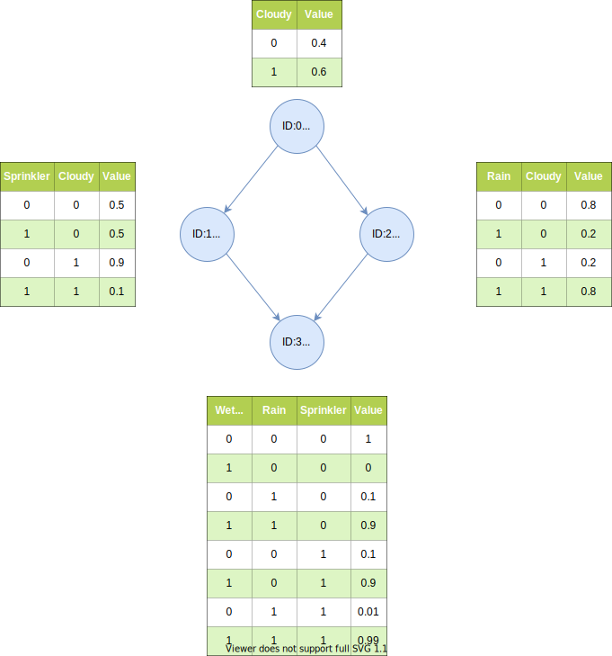

# BayesNet
This is a simple library for inference in [Bayesian Networks](https://en.wikipedia.org/wiki/Bayesian_network) in C++. It implements some basic algorithms for working with Probabilistic Graphical Models (PGM). It is based on the online Stanford course ["Probabilistic Graphical Models"](https://www.coursera.org/specializations/probabilistic-graphical-models) on Coursera. There are no dependencies to other libraries.

## Features
### Probability calculation with "factors"
- factor class (conditional probability table)
- factor product/sum
- (max) marginalization
- joint probability
### Inference algorithms
 - [Variable Elimination algorithm (VE)](https://en.wikipedia.org/wiki/Variable_elimination)
 - [Clique Tree algorithm (Junction Tree)](https://en.wikipedia.org/wiki/Junction_tree_algorithm)
   - cf. [Junction Tree - Stanford CS228](https://ermongroup.github.io/cs228-notes/inference/jt/) 
 - [Dynamic Bayes Nets (DBN)](https://en.wikipedia.org/wiki/Dynamic_Bayesian_network) - [Hidden Markov Models (HMM)](https://en.wikipedia.org/wiki/Hidden_Markov_model)
   - cf. [Dynamic Bayesian Networks: Representation, Inference and Learning (Murphy)](https://www.cs.ubc.ca/~murphyk/Thesis/thesis.html)
   - compute marginals
   - compute MAP assignements (decoding)
### Decision algorithms
- [Influence Diagram](https://en.wikipedia.org/wiki/Influence_diagram) (currently only one decision and one utility factor)

## Benefit
- Learn how to do exact inference and solve decision problems
- Eficient exact inference with the Clique Tree algorithm (Junction Tree)
- Online Inference with Dynamical Bayesian Networks (DBN)

## Limitations
- currently only discrete variables are supported
- currently only simple influence diagrams possible (one decisin, one utility factor)

## Examples
- [Water Sprinkler](examples\water_sprinkler\water_sprinkler.md)
- [Simple Bayesian Traffic Jam Detector](examples\traffic_jam\traffic_jam.ipynb)

## Recommended reading
- [Machine Learning: a Probabilistic Perspective (Murphy)](https://probml.github.io/pml-book/book0.html)
- [Dynamic Bayesian Networks: Representation, Inference and Learning (Murphy)](https://www.cs.ubc.ca/~murphyk/Thesis/thesis.html)
- [Probabilistic Graphical Models: Principles and Techniques (Koller, Friedman)](https://mitpress.mit.edu/books/probabilistic-graphical-models)

---
 

