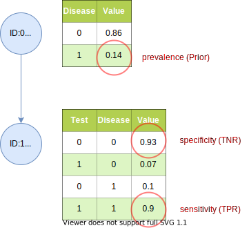

# Disease-Test

Imagine a medical diagnostic test. The test tests if a patient has a disease. The test result (false, true) depends on the presence of the disease (false, true). Before we do the test, we have the prior information, that 14% of the population have the disease (prevalence, base rate):

- P(Disease) = 0.14 

Regarding the accuracy of the test, we have the following information:

- P(Test=true |Disease=true)  = 0.9  (true positive rate, TPR, sensitivity) 
- P(Test=false|Disease=false) = 0.93 (true negative rate, TNR, specificity)

The goal is to calculate the probability that the patient has the disease given the test result is positive (true):

- P(Disease|Test=true)

This can be calculated with Base Rule from the given values:
- P(Disease|Test=true) = P(Test=true|Disease) * P(Disease) / P(Test=true)

When doing factor calculation, we do the following steps to calculate the above term:

1. For each random variable (here Disease, Test), create a factor containing the values from the (conditional) probability tables
2. Incorporate evidence, in this case: Test=true
3. Compute the joint probability P(Disease,Test=true) = P(Test=true|Disease) * P(Disease)
4. Marginalize variable Test
5. Normalize the result


References:

[1] [OpenMarkov Tutorial](http://www.openmarkov.org/docs/tutorial/) - chapter 1 and<br>
[2] [bayes-theorem-for-machine-learning](https://machinelearningmastery.com/bayes-theorem-for-machine-learning/)

---

Values from [1] [OpenMarkov Tutorial](http://www.openmarkov.org/docs/tutorial/)



Output:
```
P(Disease=true)             = 0.14 [prevalence]
P(Test=true|Disease=true)   = 0.90 [sensitivity]
P(Test=false|Disease=false) = 0.93 [specificity]

----------------------
|P(Disease|Test=true)|
|--------------------|
|   FALSE  |  TRUE   |
|----------|---------|
|   0.32   |  0.68   |
----------------------
```
---

Values from [2] [bayes-theorem-for-machine-learning](https://machinelearningmastery.com/bayes-theorem-for-machine-learning/)

Output:
```
P(Disease=true)             = 0.0002 [prevalence]
P(Test=true|Disease=true)   = 0.8500 [sensitivity]
P(Test=false|Disease=false) = 0.9500 [specificity]

----------------------
|P(Disease|Test=true)|
|--------------------|
|   FALSE  |  TRUE   |
|----------|---------|
|  0.9966  | 0.0034  |
----------------------
```
As stated in [[2](https://machinelearningmastery.com/bayes-theorem-for-machine-learning/)], the very low value for P(Disease=true|Test=true) of 0.34% is counter intuitive.
Normally, we would think, if we get a positive test result from a test with a sensitivity (true positive rate) of 85%, then we have the disease with 85% probability. This type of error in interpreting probabilities has its own name. It is called [base rate fallacy](https://en.wikipedia.org/wiki/Base_rate_fallacy).

The calculation shows that, if the patient gets a positive test result, the probability that he in fact has the disease is less than 1%, even if the sensitivity is 85%. The result is due to the low prevalence (base rate) of 0.02% of the population having the disease.