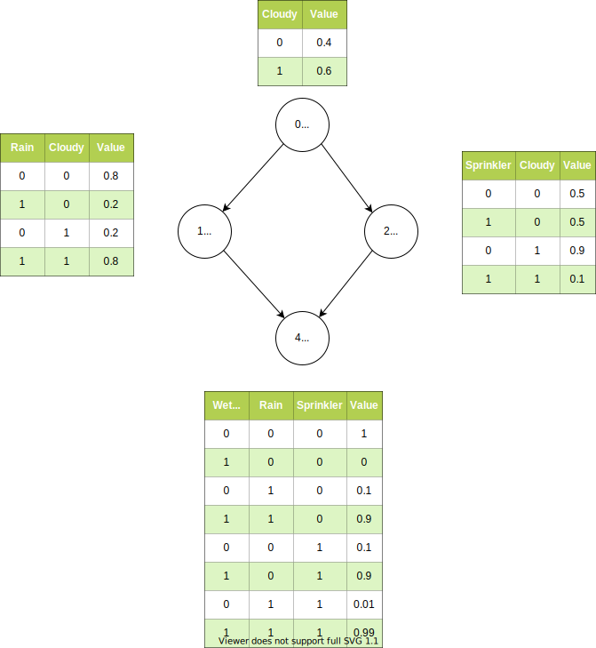

# Water Sprinkler
Classical Baysesian Network example, see  
https://www.cs.ubc.ca/~murphyk/Bayes/bnintro.html  
and  
https://webia.lip6.fr/~phw//aGrUM/docs/last/notebooks/01-tutorial.ipynb.html  

- "Sprinkler" and "Rain" depend on "Cloudy":  
Cloudy weather makes it less likely that someone turns on his water sprinkler and makes it more likely that it will rain.
- "Wet Gras" depends on both, "Sprinkler" and "Rain".  
The gras is more likely to be wet if the water sprinkler was on or if it rained.  

The Bayesian Network encodes a joint probability distribution, which factorizes in:  
P(Cloudy,Sprinkler,Rain,Wet Gras) = P(Cloudy)\*P(Sprinkler|Cloudy)\*P(Rain|Cloudy)\*P(Wet Gras|Sprinkler,Rain)  
The tables in the diagram show the factors.

